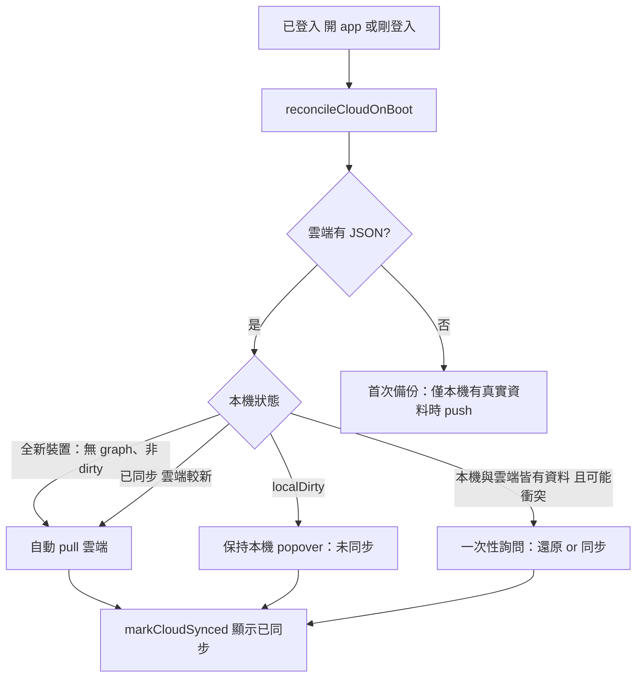

# Proposal: 換機／首次登入同步 UX + 三態衝突防護

Companion: `state.yaml`

延續已採用的 [`20260825-cloud-sync-popover`](../20260825-cloud-sync-popover/proposal.md)。本輪不推翻 localDirty 本機優先，而是補上 **換機還原** 與 **reconcile 進行中防誤觸** 的產品規則與 UI。

---

## Goal

讓 Victor 與使用者能清楚回答三個問題：

1. **優先權是誰？** → 離線改以本機為準；換機登入以雲端還原；真衝突時問一次。
2. **每次打開會自動下載嗎？** → 只有本機已同步且雲端較新時靜默 pull；其餘維持現狀並顯示狀態。
3. **換手機會不會誤推空檔刪雲端？** → 新裝置在 reconcile 完成前不得 push；已登入且雲端有備份時不顯示 seed 示範寵物。

---

## 產品規則（三態模型）



### 本機狀態定義（新增）

| 狀態 | 判定 | reconcile 行為 |
|------|------|----------------|
| **A 全新裝置** | 無 `petlive-pets-graph`、無 sync meta、或 meta 全 0 | 雲端有 → **自動 pull**；雲端無 → 等使用者有真實資料再 push |
| **B 本機優先（dirty）** | `localRevision ≠ lastSyncedRevision` | **不 pull**；popover「本機有未同步變更」 |
| **C 已同步** | dirty=false | 雲端較新 → pull；否則不動 |
| **D 衝突（可選本輪或下輪）** | dirty=false 但本機 graph 與雲端內容 fingerprint 不同 | **不自動選**；popover 或 sheet 問一次 |

**「真實資料」vs seed：** 本機 pets 若僅為 `SEED_PETS` 且從未 `bumpLocalDataRevision`，視為 **非真實**——不得 silent push 覆蓋已有雲端備份。

---

## In scope

### 1. Reconcile 生命週期（B）

- 新增 `cloudReconcileState`: `idle | running | done | error`
- 登入後與已登入開機：`reconcileCloudOnBoot` 設為 `running` → 完成後 `done`
- **`running` 期間：**
  - 禁用 popover「同步到雲端」與「從雲端還原」（或顯示 loading）
  - 首頁／pet picker 顯示 **「正在還原雲端資料…」** 輕量 overlay 或 status chip（非全屏 blocking）
- 完成後 toast（僅在有 pull 時）：`已從雲端還原`；無變更則不 toast

### 2. 換機／首次登入（B）

- 偵測 **A 全新裝置** + 雲端有 JSON → 自動 pull（維持現有邏輯，但 UI 明確）
- **已登入且雲端有備份、reconcile 未完成前：** 不 hydrate seed 到畫面（或 hydrate 後立即被 pull 覆蓋，使用者看不到 seed）
- 首次登入成功：popover 狀態依序  
  `正在檢查雲端…` → `已從雲端還原` / `本機有未同步變更` / `已同步`

### 3. 首次備份 push 收緊（B）

- `reconcileCloudOnBoot` 中 `!payload` 時：**不再無條件 silent push**
- 改為：僅當 `hasRealLocalData()`（非 seed、或 localRevision > 0）才 push
- 否則 popover 顯示「尚未備份」；使用者新增／編輯第一筆真實資料後才 debounce push

### 4. Popover 狀態文案擴充（B + C 對齊 stub）

新增 i18n 四語：

| Key | 繁中示意 |
|-----|----------|
| `accountSyncChecking` | 正在檢查雲端… |
| `accountSyncRestoring` | 正在還原雲端資料… |
| `accountSyncConflict` | 本機與雲端不同 |
| `accountSyncConflictHint` | 要保留本機還是還原雲端？ |
| `accountSyncFirstBackup` | 尚無雲端備份 |

C：同上文案；按鈕仍 stub toast。

### 5. 衝突詢問（MVP，建議本輪納入）

當 **非 dirty** 但偵測到本機 graph fingerprint ≠ 雲端（例如另一台從未 bump 過 meta 的舊資料）：

- Popover plan 區改為「本機與雲端不同」
- 兩個並排動作：**還原雲端** / **同步到雲端**（皆需 confirm，沿用既有 copy）
- **不自動** pull 或 push

若 Victor 希望本輪只做換機、衝突延後，見 Out of scope。

---

## Out of scope

- 雙向 merge／逐欄位合併（仍整包 JSON）
- Drive 圖檔媒體備份（[`20260825-drive-media-backup`](../20260825-drive-media-backup/) 另案）
- 多帳號／家庭共享
- 背景 sync worker（仍為開 app + debounce push）
- **D 衝突 fingerprint** 若本輪時間緊，可降為下輪；但 **reconcile loading + 禁 push seed** 為本輪必做

---

## UX 線框（給 Victor 檢視）

### 帳號 popover — reconcile 中

```
┌─────────────────────────────┐
│  Victor Wu          [同步]← disabled / spinner
│  user@gmail.com
├─────────────────────────────┤
│ 資料
│ 正在還原雲端資料…           │  ← accountSyncRestoring
├─────────────────────────────┤
│ [從雲端還原]  ← disabled
│ [飼主設定]
│ 首頁 │ 切換帳號 │ 登出
└─────────────────────────────┘
```

### 換機登入成功（自動 pull）

1. 登入 popup 關閉 → 進 home
2. Pet picker 上方短條：`正在還原雲端資料…`（1–3 秒）
3. 還原完成 → 顯示雲端寵物；toast `已從 Google 雲端讀回`
4. Popover → `已同步到雲端`

### 離線刪除後登入（維持現行）

- 不 pull；popover `本機有未同步變更`
- 同步鈕可用 → push 刪除結果

### 衝突 sheet（若納入 scope）

```
本機與雲端資料不同
要保留這台裝置的資料，還是還原雲端？

[同步到雲端（覆蓋雲端）]  [從雲端還原（覆蓋本機）]
```

---

## Likely files

| 檔案 | 變更 |
|------|------|
| `apps/web/app.js` | `cloudReconcileState`、`hasRealLocalData()`、reconcile 流程、seed 閘門、popover 禁用 |
| `apps/web/index.html` | reconcile status bar（可選 `#cloud-reconcile-status`） |
| `apps/web/i18n.js` | 新文案四語 |
| `apps/web/styles.css` | status bar、disabled 同步鈕 |
| `apps/web/c/*` | UI 對齊；邏輯仍 stub |

---

## Risks

| 風險 | 緩解 |
|------|------|
| reconcile 慢／離線 → 長時間禁用同步 | `error` 狀態 + 「重試」；逾時 15s 解鎖按鈕並顯示離線提示 |
| fingerprint 误判衝突 | MVP 只用 `pets.length` + 第一隻 `id` + `updatedAt` 簡化比對 |
| 已登入使用者仍短暫看到 seed | pull 完成前 pet picker skeleton，不 render seed 名稱 |
| 醫療資料誤覆蓋 | confirm 文案保留；衝突必須明示覆蓋方向 |

---

## Acceptance criteria

- [ ] 換機（無本機 graph、雲端有備份）登入 → **自動 pull**，使用者**看不到** seed 示範寵物被當成真資料
- [ ] reconcile **running** 時「同步到雲端」不可按（或顯示 checking/restoring）
- [ ] 雲端**已有**備份時，**不會**因本機只有 seed 而 silent push 覆蓋雲端
- [ ] 離線刪除 → 登入 → 仍不 auto pull；狀態「本機有未同步變更」
- [ ] 本機已同步 + 雲端較新 → 開 app 仍自動 pull（換機／多裝置）
- [ ] （若納入衝突）非 dirty 但內容不同 → 問一次，不自動覆蓋
- [ ] C 討論版：popover 狀態文案與 disabled 外觀對齊；按鈕仍 stub

---

## 與現行的差異（contrast 預覽）

| 現行（已上線） | 本輪候選 |
|----------------|----------|
| 開 app 先顯示 seed，reconcile 在背景 | 已登入+雲端有檔 → 還原完成前不展示 seed |
| 雲端無 JSON → 無條件 silent push（可能是 seed） | 僅 `hasRealLocalData` 才 push |
| reconcile 無 UI 狀態 | popover + 可選 home status bar |
| 衝突僅 dirty 一種 | + 非 dirty 內容不同時詢問（可選） |

---

## Notes for Victor

請確認本輪範圍：

1. **衝突詢問（D 狀態）** 要不要放進這一輪？還是先做「換機 + loading + 禁 seed push」？
2. Home status bar 要 **全寬 banner** 還是 **只在 popover 內** 顯示 restoring？
3. 首次備份：是否同意「使用者必須至少編輯一筆真實資料」才自動 push？（避免空帳號推 seed）

確認後回覆 **「確認」** 開始平行製作；要改範圍請 **「修改：…」**；不進行請 **「否決」**。
